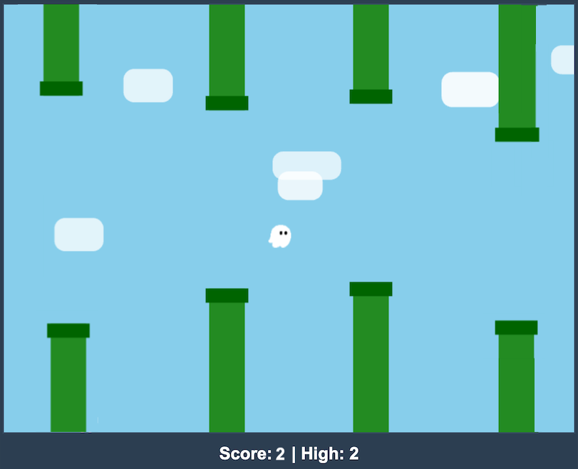

# Flappy Kiro

A retro-style arcade Flappy Bird game built with HTML5 2D Canvas and modern ES6 modules. Navigate your cyber-bird through procedural pipe obstacles, score points, and set high scores!

---

## 🖼️ Example UI Reference

Below is the initial reference UI layout used during early game prototyping:



---

## ✨ Features

| Feature | Description |
|---|---|
| **Arcade Physics** | Custom gravity acceleration, flap jump impulse, and smooth vertical movement. |
| **Procedural Obstacles** | Randomly generated pipe heights with fixed gap spacing and offscreen pipe recycling. |
| **Audio Feedback** | Non-blocking sound effects for jump actions (`assets/jump.wav`) and game over collisions (`assets/game_over.wav`). |
| **High Score Persistence** | Tracks best scores locally using `localStorage` across browser sessions. |
| **Responsive Controls** | Supports `Spacebar`, `Up Arrow`, mouse clicks, and touch screen controls for mobile devices. |
| **Modular Architecture** | Clean component-based design splitting physics, rendering, pipe management, and state logic. |

---

## 🕹️ Controls

| Action | Controls |
|---|---|
| **Flap / Jump** | Press `Spacebar` / `Up Arrow`, Click Canvas, or Tap Screen |
| **Start / Retry** | Press `Spacebar`, Click Canvas, or Tap Screen |

---

## 🔊 Audio Assets & Sound Effects

The game features real-time audio feedback managed by the **`SoundFX`** controller in **[js/audio.js](file:///Users/shreyash/projects/Antigravity%20Repo/p5-js-logs/sketch-05/js/audio.js)**. Audio playback is non-blocking with error safety handling for browser autoplay policies:

| Sound Effect | Asset Path | Format & File Size | Trigger Event | Behavior & Technical Detail |
|---|---|---|---|---|
| **Flap / Jump** | `assets/jump.wav` | WAV (`65.2 KB`) | Pressing `Spacebar` / `Up Arrow`, clicking canvas, or tapping screen to jump | Executed via `soundFX.play('jump')`. Resets `currentTime = 0` before playback so rapid successive flap inputs trigger crisp sound without clipping delay. |
| **Game Over / Crash** | `assets/game_over.wav` | WAV (`396.3 KB`) | Colliding with canvas bounds or pipe obstacles | Executed via `soundFX.play('gameOver')`. Plays defeat audio cue upon state transition to `STATE.OVER`. |

---

## 🤖 AI-DLC (AI Development Life Cycle) Integration

This sketch was initially designed and developed using an **AI-DLC (AI Development Life Cycle)** workflow with Amazon Q and AWS Kiro.

| AI-DLC Asset | Purpose & Usage |
|---|---|
| 📄 **[AI-DLC.md](file:///Users/shreyash/projects/Antigravity%20Repo/p5-js-logs/sketch-05/AI-DLC.md)** | Explains the load-on-demand workflow architecture, prompt optimization strategy (reducing system prompt size by 85%), and phase branch execution. |
| 📁 **[aidlc-docs/](file:///Users/shreyash/projects/Antigravity%20Repo/p5-js-logs/sketch-05/aidlc-docs)** | Phase state artifacts generated during initial game creation: |
| &nbsp;&nbsp;├─ `aidlc-state.md` | Tracks active AI execution phase state and workflow transitions. |
| &nbsp;&nbsp;├─ `audit.md` | Audits requirements fulfillment, feature verification, and test coverage. |
| &nbsp;&nbsp;├─ `inception/` | Initial requirement specifications, intent statements, and user stories. |
| &nbsp;&nbsp;└─ `construction/` | Detailed component breakdown plans and construction units. |

---

## 📂 Project Structure & Resources

```
sketch-05/
├── index.html                  # Canvas host page (loads type="module" src="sketch.js")
├── sketch.js                   # Main game loop orchestrator
├── README.md                   # Project documentation & UI reference
├── CHANGELOG.md                # Release version history
├── AI-DLC.md                   # AI-DLC workflow specification
├── aidlc-docs/                 # AI-DLC inception & construction phase artifacts
├── package.json & babel.config.js # Jest testing setup
├── sketch.test.js              # Automated Jest unit test suite
├── img/                        # UI mockup screenshots
│   └── example-ui.png          # Reference UI design image
├── assets/                     # Game sound effects & image assets
│   ├── jump.wav               # Jump / flap sound effect (65 KB WAV)
│   ├── game_over.wav          # Collision / game over sound effect (396 KB WAV)
│   └── ghosty.png             # Game sprite graphic asset
└── js/                         # ES6 Module Directory
    ├── config.js               # Game constants (gravity, jump, pipe speed, canvas size)
    ├── audio.js                # SoundFX loader and audio player
    ├── bird.js                 # Bird entity physics, bounds, and renderer
    ├── pipes.js                # PipeManager class (spawning, recycling, collision detection)
    └── game-state.js           # GameState Manager (START, PLAY, OVER, scores, HUD)
```

---

## 🛠️ Module Reference

| Module | Responsibility |
|---|---|
| **`js/config.js`** | Physical constants (`GRAVITY`, `JUMP`, `PIPE_WIDTH`, `GAP`, `PIPE_SPEED`, `SPAWN_RATE`). |
| **`js/audio.js`** | Audio asset loading (`jump.wav`, `game_over.wav`) with graceful error handling. |
| **`js/bird.js`** | Bird vertical velocity, jump impulse, bounds checking, and pixel-art renderer. |
| **`js/pipes.js`** | Pipe array management, leftward scrolling, score triggers, and AABB collision checks. |
| **`js/game-state.js`** | Game state transitions, LocalStorage high score saving, and HUD/overlay drawing. |

---

## 💻 Setup & Running Tests

### Running Locally
1. Clone or download the repository.
2. Open `index.html` directly in any modern web browser. No build tools needed!

### Running Unit Tests
1. Navigate to the `sketch-05/` directory:
   ```bash
   cd sketch-05
   ```
2. Install test dependencies:
   ```bash
   npm install
   ```
3. Run Jest tests:
   ```bash
   npm test
   ```