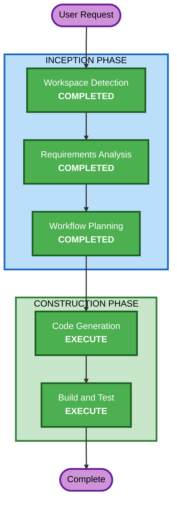

# Execution Plan

## Detailed Analysis Summary

### Change Impact Assessment
- **User-facing changes**: Yes - Entire game is new user-facing application
- **Structural changes**: Yes - New project structure from scratch
- **Data model changes**: No - Simple score persistence only
- **API changes**: No - Standalone desktop application
- **NFR impact**: Yes - 60 FPS performance target, smooth input handling

### Risk Assessment
- **Risk Level**: Low (greenfield, no existing systems affected)
- **Rollback Complexity**: Easy (no dependencies on other systems)
- **Testing Complexity**: Simple (manual gameplay testing)

## Workflow Visualization

## Phases to Execute

### INCEPTION PHASE
- [x] Workspace Detection (COMPLETED)
- [x] Requirements Analysis (COMPLETED)
- [x] Workflow Planning (COMPLETED)
- Reverse Engineering - SKIP
  - **Rationale**: Greenfield project, no existing code to analyze
- User Stories - SKIP
  - **Rationale**: Single user type (player), simple interaction model (press spacebar)
- Application Design - SKIP
  - **Rationale**: Single-file game with straightforward component structure; Pygame game loop pattern is well-established
- Units Generation - SKIP
  - **Rationale**: Single unit of work (one game application)

### CONSTRUCTION PHASE
- Functional Design - SKIP
  - **Rationale**: Game logic is well-defined in requirements; standard Flappy Bird mechanics don't need additional design elaboration
- NFR Requirements - SKIP
  - **Rationale**: NFRs are simple (60 FPS, responsive input) and already captured in requirements
- NFR Design - SKIP
  - **Rationale**: No complex NFR patterns needed; Pygame handles rendering/timing natively
- Infrastructure Design - SKIP
  - **Rationale**: No cloud infrastructure; standalone desktop application
- Code Generation - EXECUTE (ALWAYS)
  - **Rationale**: Core implementation needed
- Build and Test - EXECUTE (ALWAYS)
  - **Rationale**: Build instructions and test verification needed

## Success Criteria
- **Primary Goal**: Playable Flappy Bird clone with Ghosty character
- **Key Deliverables**: 
  - Working Python/Pygame game
  - Start screen, gameplay, and game over states
  - Parallax background, styled walls
  - Score display and high score persistence
  - Sound effects on jump and game over
- **Quality Gates**:
  - Game runs at 60 FPS
  - Collision detection is accurate
  - All three game states transition correctly
  - Assets load and display/play correctly
